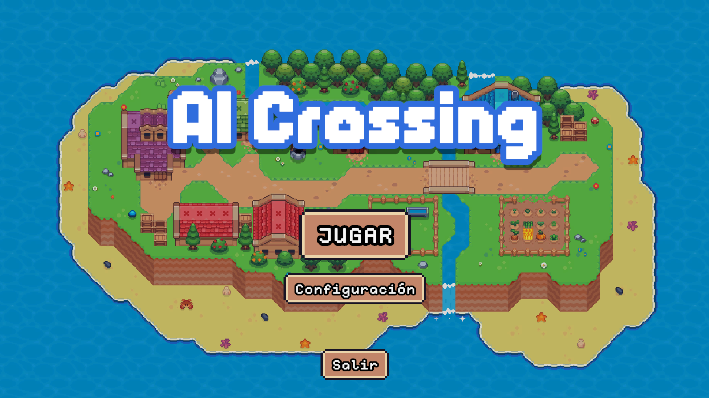
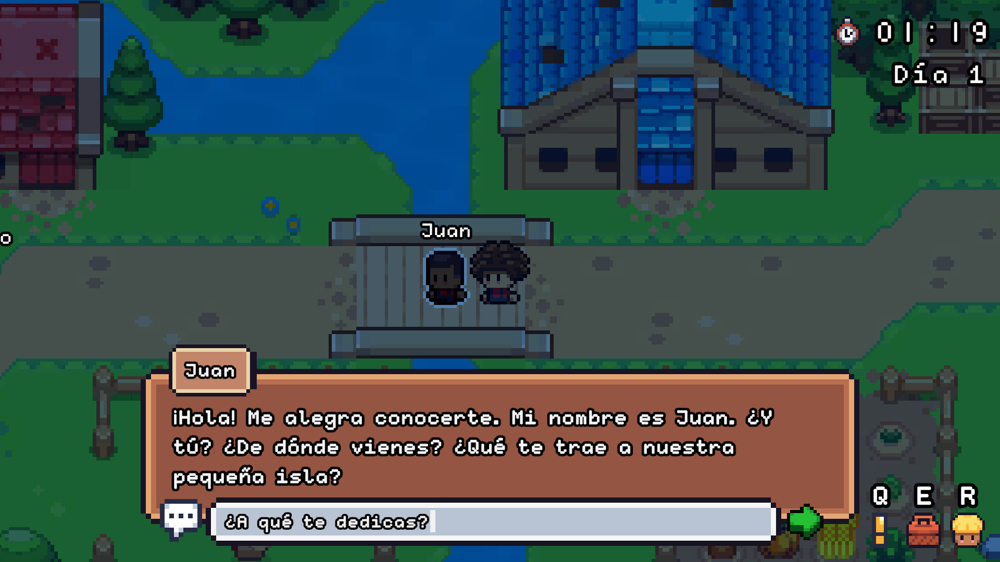
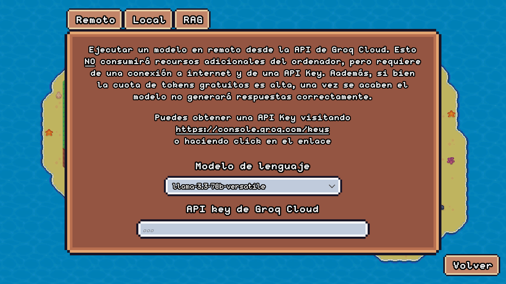

# 🏝️ AI Crossing: Integración de LLMs en la interacción con NPCs con asistencia del diseñador

**Trabajo Fin de Grado** centrado en la exploración de la integración de modelos de lenguaje (LLMs) en personajes no jugables (NPCs) dentro un videojuego, con **asistencia directa del diseñador** para minimizar problemas como las alucionanciones y mantener un mayor control sobre el flujo narrativo.

El proyecto aborda especialmente dos componentes clave de los NPCs:
- 🗨️ **Diálogos**
- 🎯 **Misiones**

## 🎮 Sobre el prototipo: AI Crossing

Te acabas de mudra a una pequeña aldea en una isla apartada. Tu principal objetivo es conocer a los vecinos del lugar y ganarte su confianza, con la esperanza de encontrar tu sitio en esta nueva vida.

Tendrás **3 días** para:
- Interactuar con los habitantes.
- Ofrecer tu ayuda en lo que necesiten.

Si al finalizar ese tiempo no has conseguido encajar, tomarás la decisión de **regresar a tu antigua vida**.

## 📷 Capturas del juego





## 🧠 Modelos y arquitectura
El juego utiliza distiontos modelos basados en la arquitectura *Transformer*, que pueden ejecutarse de varias formas:

- 🔗 **Remoto**: a través de [Groq Cloud](https://groq.com/groqcloud/) (*recomendado por rendimiento y estabilidad*).
  
- 🖥️ **Servidor local**: mediante [Llamafile](https://github.com/Mozilla-Ocho/llamafile).
  
- 🎮 **Integrado en el juego**: utilizando [Llama.Cpp](https://github.com/ggml-org/llama.cpp) (*actualmente en una fase temprana, funcional pero con algunos errores*).

> ⚠️ Las dos últimas opciones requieren de un equipo con buena capacidad de procesamiento.
>
> Además es necesario descargar un modelo en formato **GGUF**, disponible en sitios como [Hugging Face](https://huggingface.co/).

También se emplea un servidor de vectores, [Pinecone](https://www.pinecone.io/), para proporcionar **información contextual** a los personajes del juego.

## 🔧 Configuración

Existe una **pantalla de opciones** al inicio del juego para seleccionar entre los distintos modos de ejecución de los modelos.

También es posible **automatizar la configuración** añadiendo un archivo JSON en la carpeta ```Documentos``, con el siguiente formato:
```json
{
    "groq_cloud": "..."
    "pinecone": "..."
}
```



## 🛠️ Herramienta de generación de misiones
Se ha desarrollado una herramienta complementaria en Python para generar misiones.

Puedes encontrar más detalles en:

📁 [Python/README.md](Python/readme.md)

## ⚠️ Aviso sobre *assets* de pago

El juego utiliza el *asset* de pago [Behavior Designer](https://opsive.com/assets/behavior-designer/).

> Si descargas el código fuente directamente, se producirán errores de compilación debido a su ausencia.

Sin embargo, puedes jugar al juego completo descargándolo desde la sección **Releases**.
